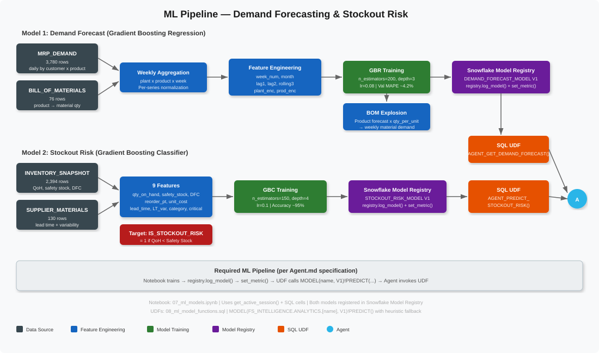

# First Solar Supply Chain Intelligence Agent

A Snowflake Intelligence Agent providing natural-language access to First Solar's CdTe thin-film solar module manufacturing supply chain — covering inventory, procurement, supplier risk, manufacturing scheduling, demand forecasting, anomaly detection, and lot traceability across three US plants.


## Agent Tools (10)

| Tool | Type | Purpose |
|------|------|---------|
| SupplyChainOps | Cortex Analyst | Inventory, POs, suppliers, transfers, recommendations |
| ManufacturingDemand | Cortex Analyst | Production schedule, demand forecasts, BOM, customers |
| RiskIntelligence | Cortex Analyst | Risk profiles, trade lanes, benchmarks, anomalies |
| OperationalNotesSearch | Cortex Search | WHY questions (recommendation reasons, schedule changes) |
| SupplierEventsSearch | Cortex Search | Supplier disruption history (force majeure, delays) |
| RiskSearch | Cortex Search | Sourcing risk notes, logistics route intelligence |
| StockoutRiskPredictor | UDF (ML) | Top 25 materials at stockout risk |
| DemandForecast | UDF (ML) | 8-week product demand forecast with confidence intervals |
| MaterialRiskSummary | UDF | Single-source critical material profiles |
| SupplyChainKPIs | UDF | Executive KPI dashboard summary |

## Quick Start

See [docs/AGENT_SETUP.md](docs/AGENT_SETUP.md) for full step-by-step instructions.

### Execution Order


```
1. sql/setup/01_database_and_schema.sql     → FS_INTELLIGENCE database + schemas
2. sql/setup/02_create_tables.sql           → 22 tables (RAW + REFERENCE)
3. sql/data/03_generate_synthetic_data.sql  → Load CSV data from stage
3b. sql/data/03b_supply_chain_intelligence.sql → Seed risk/trade/benchmark/event data
4. sql/views/04_create_views.sql            → 7 analytical views
5. sql/views/05_create_semantic_views.sql   → 3 semantic views (via YAML)
6. sql/search/06_create_cortex_search.sql   → 3 Cortex Search services
7. notebooks/07_ml_models.ipynb             → Train + register 2 ML models
8. sql/models/08_ml_model_functions.sql     → 4 UDFs (MODEL()!PREDICT())
9. sql/agent/09_create_agent.sql            → CREATE AGENT (YAML, 10 tools, sample_questions)
```

## Data Model

- **3 plants** (Perrysburg OH x2, Mesa AZ) — 3.3 GW combined capacity
- **50 materials** across 11 categories (Glass, Semiconductor, Frame, Electronics, Chemicals, Backsheet, Equipment Consumable, Packaging, Thermal, QA Consumable, Hardware)
- **20 suppliers** (USA, Japan, Canada, Belgium, Austria) — Tier1/Tier2 with risk scores
- **2 products** (Series 6 450W, Series 7 500W CdTe modules)
- **15 customers** (utility-scale and commercial solar developers)

## ML Pipeline



- **DEMAND_FORECAST_MODEL** — Gradient Boosting Regression, ~4.2% MAPE
- **STOCKOUT_RISK_MODEL** — Gradient Boosting Classifier, calls via MODEL()!PREDICT()

## Sample Questions

```
Inventory: What is the total inventory value by plant?
Inventory: Which materials are below safety stock?
Procurement: What are the total expediting costs by supplier?
Procurement: Which POs are overdue?
Supplier: Which suppliers have the worst on-time delivery?
Supplier: Has 5N Plus had any supply disruptions recently?
Schedule: What is the manufacturing schedule adherence by plant?
Schedule: Why was production reduced at Ohio?
Forecast: What is the demand forecast for Series 7 at Arizona?
Risk: Which materials are single-source with no substitutes?
Risk: How does our semiconductor lead time compare to benchmarks?
Risk: Which trade lanes have the highest geopolitical risk?
Executive: Give me a supply chain health summary.
```

## Documentation

- [AGENT_SETUP.md](docs/AGENT_SETUP.md) — Full deployment guide
- [DEPLOYMENT_SUMMARY.md](docs/DEPLOYMENT_SUMMARY.md) — Current deployment status
- [questions.md](docs/questions.md) — 36+ test questions by domain

## Deployment Status

See [docs/DEPLOYMENT_SUMMARY.md](docs/DEPLOYMENT_SUMMARY.md) for full details.

**Current:** Deployed to AWS161 | Agent: `FS_INTELLIGENCE.ANALYTICS.FIRST_SOLAR_AGENT` | PUBLIC role access
