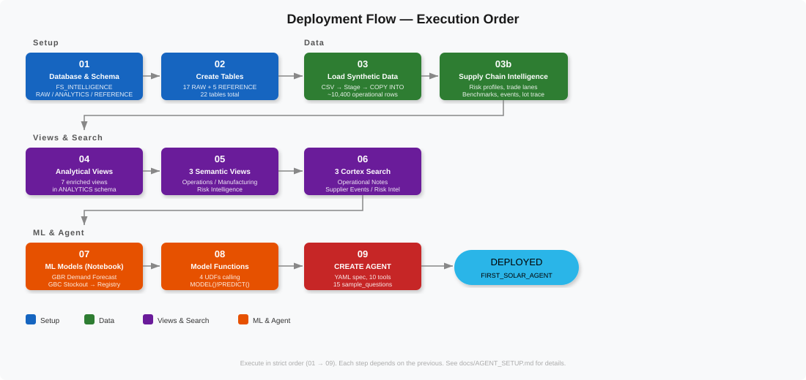

# First Solar Agent — Setup Guide

Step-by-step instructions to deploy the First Solar Supply Chain Intelligence Agent.

## Prerequisites

| Requirement | Details |
|-------------|---------|
| Snowflake Account | AWS161 (or any account with Cortex Agent support) |
| Role | ACCOUNTADMIN (or role with CREATE AGENT, CREATE SEMANTIC VIEW) |
| Warehouse | FIRST_SOLAR_WH (created in step 01) |
| Python | 3.9+ with `numpy`, `scikit-learn`, `snowflake-ml-python` |
| Local Files | This repository cloned locally |

## Execution Order

Execute SQL files in strict sequential order. Each step depends on the previous.



---

### Step 1: Database and Schema Setup

```sql
-- File: sql/setup/01_database_and_schema.sql
-- Creates: FS_INTELLIGENCE database, RAW/ANALYTICS/REFERENCE schemas, FIRST_SOLAR_WH warehouse
```

**Run in Snowsight or SnowSQL:**
```
USE ROLE ACCOUNTADMIN;
-- Execute full contents of sql/setup/01_database_and_schema.sql
```

**Expected output:** Database, 3 schemas, and warehouse created.

---

### Step 2: Create Tables

```sql
-- File: sql/setup/02_create_tables.sql
-- Creates: 17 tables in RAW schema + 5 tables in REFERENCE schema (22 total)
```

**Expected output:** All 22 tables created successfully.

---

### Step 3: Load Synthetic Data

**3a. Generate CSVs (if not already present):**
```bash
cd data/
python generate_data.py
```
This produces 18 CSV files in `data/csv/`.

**3b. Upload to Snowflake stage:**
```sql
-- In Snowflake:
PUT file:///path/to/first-solar-agent/data/csv/*.csv @FS_INTELLIGENCE.RAW.SC_DATA_STAGE AUTO_COMPRESS=FALSE OVERWRITE=TRUE;
```

**3c. Execute the COPY statements:**
```sql
-- File: sql/data/03_generate_synthetic_data.sql
```

**Expected output:** Verification query shows row counts for all 16 operational tables.

---

### Step 3b: Seed Supply Chain Intelligence Data

```sql
-- File: sql/data/03b_supply_chain_intelligence.sql
-- Seeds: MATERIAL_RISK_PROFILE (50), TRADE_LANE_DIM (54), INDUSTRY_BENCHMARK_DIM (38),
--        SUPPLIER_EVENT_LOG (20), MATERIAL_LOT_TRACE (37)
```

**Expected output:** 199 rows across 5 REFERENCE tables.

---

### Step 4: Create Analytical Views

```sql
-- File: sql/views/04_create_views.sql
-- Creates: 7 views in ANALYTICS schema
```

**Views created:**
- V_INVENTORY_HEALTH
- V_SUPPLIER_SCORECARD
- V_OPEN_PO_PIPELINE
- V_MANUFACTURING_ADHERENCE
- V_RECOMMENDATIONS_ENRICHED
- V_FORECAST_ACCURACY
- V_ANOMALY_SUMMARY

---

### Step 5: Create Semantic Views (3)

```sql
-- File: sql/views/05_create_semantic_views.sql
-- Creates: 3 semantic views via SYSTEM$CREATE_SEMANTIC_VIEW_FROM_YAML
```

**Semantic views created:**
| View | Tables | Purpose |
|------|--------|---------|
| SUPPLY_CHAIN_OPERATIONS_SV | 8 tables | Inventory, POs, suppliers, transfers, recommendations |
| MANUFACTURING_DEMAND_SV | 6 tables | Schedule, forecasts, BOM, customers, MRP |
| RISK_INTELLIGENCE_SV | 7 tables | Risk profiles, trade lanes, benchmarks, anomalies |

---

### Step 6: Create Cortex Search Services (3)

```sql
-- File: sql/search/06_create_cortex_search.sql
-- Creates: 3 Cortex Search services in ANALYTICS schema
```

| Service | Source Data | Use Case |
|---------|------------|----------|
| OPERATIONAL_NOTES_SEARCH | Rec reasons, alert descriptions, schedule changes | "Why" questions |
| SUPPLIER_EVENTS_SEARCH | Supplier event log (20 events) | Disruption history |
| RISK_INTELLIGENCE_SEARCH | Risk profile notes + trade lane notes | Sourcing intelligence |

**Note:** Search services take a few minutes to build their initial index.

---

### Step 7: Train ML Models (Notebook)

Open `notebooks/07_ml_models.ipynb` in Snowflake Notebooks.

**Models trained:**
1. **DEMAND_FORECAST_MODEL** (GBR) — weekly product demand prediction
2. **STOCKOUT_RISK_MODEL** (GBC) — stockout probability classification

**Both are registered in the Snowflake Model Registry** via `snowflake.ml.registry.Registry`.

---

### Step 8: Create ML Model Functions

```sql
-- File: sql/models/08_ml_model_functions.sql
-- Creates: 4 UDFs in ANALYTICS schema
```

| Function | Returns | Purpose |
|----------|---------|---------|
| AGENT_PREDICT_STOCKOUT_RISK() | ARRAY | Top 25 at-risk materials via MODEL()!PREDICT() |
| AGENT_GET_DEMAND_FORECAST() | ARRAY | 8-week product demand forecast |
| AGENT_GET_MATERIAL_RISK_SUMMARY() | ARRAY | Single-source critical material profiles |
| AGENT_GET_SUPPLY_CHAIN_KPIS() | OBJECT | Executive KPI dashboard |

---

### Step 9: Create Agent

```sql
-- File: sql/agent/09_create_agent.sql
-- Creates: FIRST_SOLAR_AGENT with YAML spec, 10 tools, sample_questions
-- Grants: PUBLIC role access to all objects
```

**Agent tools (10):**
- 3 Cortex Analyst (SupplyChainOps, ManufacturingDemand, RiskIntelligence)
- 3 Cortex Search (OperationalNotes, SupplierEvents, RiskSearch)
- 4 UDFs (StockoutRisk, DemandForecast, MaterialRisk, KPIs)

---

## Verification

After deployment, verify all objects:

```sql
SHOW SEMANTIC VIEWS IN SCHEMA FS_INTELLIGENCE.ANALYTICS;    -- Should return 3
SHOW CORTEX SEARCH SERVICES IN SCHEMA FS_INTELLIGENCE.ANALYTICS; -- Should return 3
SHOW AGENTS LIKE 'FIRST_SOLAR_AGENT' IN SCHEMA FS_INTELLIGENCE.ANALYTICS; -- Should return 1

-- Test a UDF:
SELECT FS_INTELLIGENCE.ANALYTICS.AGENT_GET_SUPPLY_CHAIN_KPIS();
```

## Troubleshooting

| Issue | Solution |
|-------|----------|
| "insufficient privileges" on CREATE AGENT | Ensure role has CREATE AGENT on schema |
| Semantic view creation fails | Check SELECT privilege on all referenced tables |
| Cortex Search shows 0 rows | Verify source tables have data; wait for initial index build |
| MODEL()!PREDICT() fails | Run notebook step 7 first to register models |
| Agent returns "no tool resources" | Verify semantic view and search service names match agent spec |
