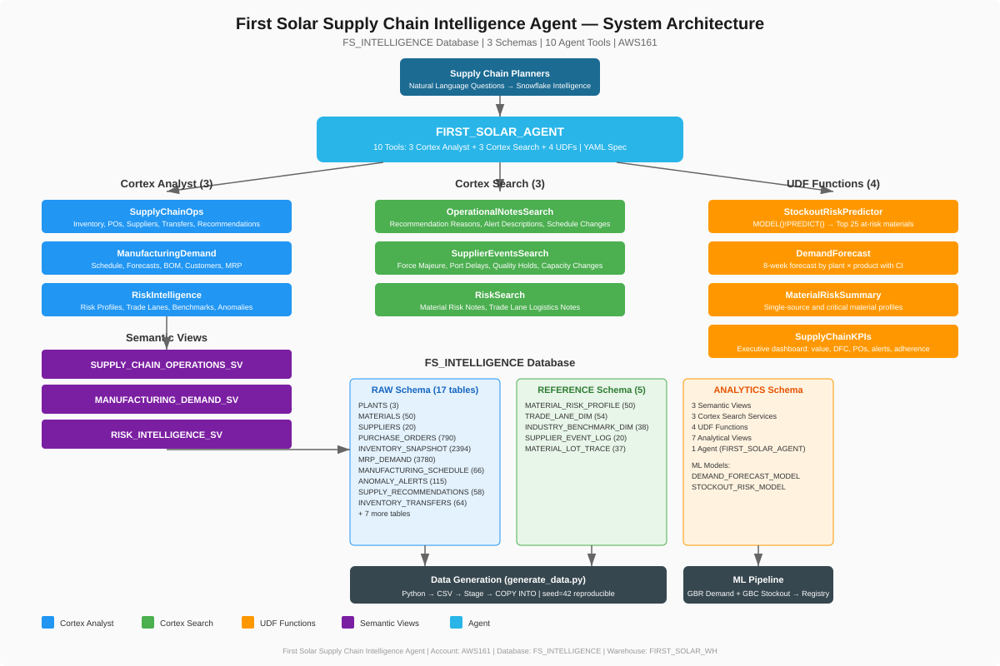

# First Solar Agent — Deployment Summary

**Deployed:** July 27, 2026
**Account:** AWS161
**Database:** FS_INTELLIGENCE
**Agent:** FS_INTELLIGENCE.ANALYTICS.FIRST_SOLAR_AGENT

---

## Architecture Overview



---

## Deployed Objects

### Database Infrastructure

| Object | Type | Details |
|--------|------|---------|
| FS_INTELLIGENCE | Database | Main project database |
| FS_INTELLIGENCE.RAW | Schema | 17 operational tables |
| FS_INTELLIGENCE.ANALYTICS | Schema | Views, semantic views, search, UDFs, agent |
| FS_INTELLIGENCE.REFERENCE | Schema | 5 supply chain intelligence tables |
| FIRST_SOLAR_WH | Warehouse | X-Small, auto-suspend 300s |

### Tables (22 total)

**RAW Schema (17 tables):**

| Table | Rows | Description |
|-------|------|-------------|
| PLANTS | 3 | Manufacturing plants (OH1, OH2, AZ1) |
| CUSTOMERS | 15 | Utility and commercial solar customers |
| MATERIALS | 50 | CdTe module materials (11 categories) |
| SUPPLIERS | 20 | Global suppliers (5 countries) |
| SUPPLIER_MATERIALS | 130 | Supplier-material-plant mappings |
| BILL_OF_MATERIALS | 76 | BOM for Series 6 + Series 7 |
| INVENTORY_SNAPSHOT | 2,394 | Weekly inventory per plant/material |
| MRP_DEMAND | 3,780 | Daily demand by customer/product |
| PURCHASE_ORDERS | 790 | POs (Open, In Transit, Received) |
| PO_RECEIPTS | 319 | Receipt records with quality status |
| INVENTORY_TRANSFERS | 64 | Inter-plant material transfers |
| SUPPLY_RECOMMENDATIONS | 58 | AI-generated actions (16 CRITICAL) |
| ANOMALY_ALERTS | 115 | Detected anomalies (27 recent unresolved) |
| MANUFACTURING_SCHEDULE | 66 | Weekly production schedule |
| PRODUCT_DEMAND_FORECAST | 132 | ML product-level forecast |
| DEMAND_FORECAST | 2,508 | BOM-exploded material forecast |
| FORECAST_MODEL_META | 3 | Model hyperparameters |

**REFERENCE Schema (5 tables):**

| Table | Rows | Description |
|-------|------|-------------|
| MATERIAL_RISK_PROFILE | 50 | Sourcing risk for all 50 materials |
| TRADE_LANE_DIM | 54 | Physical logistics routes |
| INDUSTRY_BENCHMARK_DIM | 38 | CdTe manufacturing KPIs |
| SUPPLIER_EVENT_LOG | 20 | 6-month disruption history |
| MATERIAL_LOT_TRACE | 37 | Lot traceability chains |

### Semantic Views (3)

| View | Tables | Verified Queries |
|------|--------|-----------------|
| SUPPLY_CHAIN_OPERATIONS_SV | 8 (inventory, POs, receipts, suppliers, materials, plants, transfers, recs) | 5 VQRs |
| MANUFACTURING_DEMAND_SV | 6 (schedule, product forecast, material forecast, MRP, customers, plants) | 4 VQRs |
| RISK_INTELLIGENCE_SV | 7 (risk profiles, trade lanes, benchmarks, anomalies, materials, suppliers, plants) | 4 VQRs |

### Cortex Search Services (3)

| Service | Source Rows | Indexed Content |
|---------|-------------|-----------------|
| OPERATIONAL_NOTES_SEARCH | ~194 | Recommendation reasons + alert descriptions + schedule changes |
| SUPPLIER_EVENTS_SEARCH | 20 | Supplier disruption event narratives |
| RISK_INTELLIGENCE_SEARCH | ~104 | Material risk notes + trade lane logistics notes |

### UDFs (4)

| Function | Returns | Description |
|----------|---------|-------------|
| AGENT_PREDICT_STOCKOUT_RISK() | ARRAY | Top 25 materials at stockout risk |
| AGENT_GET_DEMAND_FORECAST() | ARRAY | 8-week forecast with confidence intervals |
| AGENT_GET_MATERIAL_RISK_SUMMARY() | ARRAY | Critical single-source material profiles |
| AGENT_GET_SUPPLY_CHAIN_KPIS() | OBJECT | Executive KPI dashboard |

### Agent Configuration

| Property | Value |
|----------|-------|
| Name | FIRST_SOLAR_AGENT |
| Location | FS_INTELLIGENCE.ANALYTICS |
| Spec Format | YAML |
| Tools | 10 (3 Analyst + 3 Search + 4 UDF) |
| Budget | 60 seconds / 32,000 tokens |
| Sample Questions | 15 curated Q&A pairs |
| Access | Granted to PUBLIC role |

---

## Live KPI Snapshot

| Metric | Value |
|--------|-------|
| Total Inventory Value | $76.2M |
| Avg Days Forward Coverage | 48.7 days |
| Open Purchase Orders | 471 |
| Total Expediting Cost | $2.1M |
| Critical Recommendations | 31 |
| Unresolved High-Severity Alerts | 38 |
| Manufacturing Schedule Adherence | 98.4% |
| Materials Below Safety Stock | 23 |
| Overdue POs | 10 |

---

## Access Grants

```sql
GRANT USAGE ON DATABASE FS_INTELLIGENCE TO ROLE PUBLIC;
GRANT USAGE ON SCHEMA FS_INTELLIGENCE.ANALYTICS TO ROLE PUBLIC;
GRANT USAGE ON SCHEMA FS_INTELLIGENCE.RAW TO ROLE PUBLIC;
GRANT USAGE ON SCHEMA FS_INTELLIGENCE.REFERENCE TO ROLE PUBLIC;
GRANT SELECT ON ALL TABLES IN SCHEMA FS_INTELLIGENCE.RAW TO ROLE PUBLIC;
GRANT SELECT ON ALL TABLES IN SCHEMA FS_INTELLIGENCE.REFERENCE TO ROLE PUBLIC;
GRANT SELECT ON ALL VIEWS IN SCHEMA FS_INTELLIGENCE.ANALYTICS TO ROLE PUBLIC;
GRANT REFERENCES, SELECT ON SEMANTIC VIEW ... TO ROLE PUBLIC;  -- all 3 SVs
GRANT USAGE ON AGENT FS_INTELLIGENCE.ANALYTICS.FIRST_SOLAR_AGENT TO ROLE PUBLIC;
GRANT USAGE ON WAREHOUSE FIRST_SOLAR_WH TO ROLE PUBLIC;
```

---

## How to Access

- **Snowflake Intelligence:** Navigate to FS_INTELLIGENCE.ANALYTICS.FIRST_SOLAR_AGENT
- **Cortex Agent API:** REST endpoint with agent FQN
- **All users** in account can access via PUBLIC role
